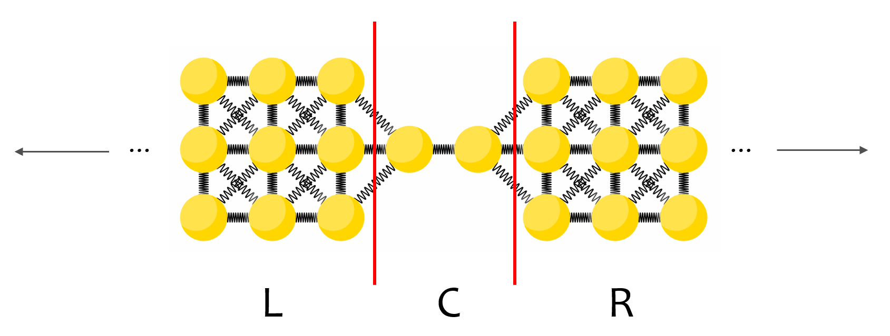

# PhonoKit



Phononic transmission calculation for different model configurations of electrodes and the scattering region.
Using the 

> config_dat.json

you can specify your calculation setup as a dictionary. The configuration gives you the options to specify general calculation settings 
but also to define your left (L) elctrode, the central scattering region (C) and the right (R) electrode as you want within the allowed
and reasonable configurations.

In the following, the config_dat.json is shown with explanations for each parameter. Furthermore, there are several ways how you can setup your electrode:

***Debye model***: Only linear chains reasonable.\
***Chain1D***: Analytical setup for a 1D chain.\
***Ribbon2D***: Finite 2D Ribbon with coupling in x, y and xy-direction.\
***AnalyticalFourier***: The (quasi-)infinite electrode is setup analytically by fourier transforming an atom in the periodic y-direction.\
***DecimationFourier***: Whole finite unit cell (L-C-R) is extended periodically in y-direction (transverse to transport).\

**General calculation parameters**
```
{
    
    "CALCULATION": {

        "data_path": "path/where/you/want/the/results",
        "sys_descr": "name of your calculation",

        "M_E": Element shortcut within the left (L) and right (R) electrode (e.g. Au) -> str,
        "M_C": Element shortcut within the central scattering-region (C) (e.g. Au) -> str,
        "E_D": Debye energy -> float,
        "N": Number of grid-points -> int,
        "T_min": Minimal temperature -> float,
        "T_max": Maximal temperature -> float,
        "kappa_grid_points": Number of grid-points -> int,
        "T_kappa_c": -> float
    },

```

**Electrode parameters (here the left electrode)**
```
    "ELECTRODE_L": {

        "DebeyeModel": {
            "enabled": decide which model you want to activate -> bool (lower letter in .json, e.g. true),
            "k_coupl_x": coupling constant to the center in x-direction -> float,
            "k_coupl_xy": 0
        },

        "Chain1D": {
            "enabled": false,
            "k_el_x": coupling constant within the electrode in x-direction -> float,
            "k_coupl_x": coupling constant to the center in x-direction -> float,
            "interaction_range": how many neighbours you take into account for interaction -> int,
            "interact_potential": interaction potential -> str (for now, only "reciproke_squared"),
            "atom_type": -> str,
            "lattice_constant": -> float
        },

        "Ribbon2D": {
            "enabled": -> bool,
            "N_y": Numbers of atoms for finite electrode size,
            "k_el_x": coupling constant within the electrode in x-direction -> float,
            "k_el_y": coupling constant within the electrode in y-direction -> float,
            "k_el_xy": coupling constant within the electrode in xy-direction -> float,
            "k_coupl_x": coupling constant to the center in x-direction -> float,
            "k_coupl_xy": coupling constant to the center in xy-direction -> float,
            "interaction_range": -> int,
            "interact_potential": -> str,
            "atom_type": -> str,
            "lattice_constant": -> float
        },

        "AnalyticalFourier": {
            "enabled": -> bool,
            "N_q": Number of reciprocal grid-points for the fourier transformation -> int,
            "k_el_x": -> float,
            "k_el_y": -> float,
            "k_el_xy": -> float,
            "k_coupl_x": -> float,
            "k_coupl_xy": -> flaot,
            "interaction_range": -> int,
            "interact_potential": -> str,
            "atom_type": -> str,
            "lattice_constant": -> float
        },

        "DecimationFourier": {
            "enabled": -> bool,
            "N_y": -> int,
            "N_q": -> int,
            "k_el_x": -> float,
            "k_el_y": -> float,
            "k_el_xy": -> float,
            "k_coupl_x": -> float,
            "k_coupl_xy": -> float,
            "interaction_range": str,
            "interact_potential": -> str,
            "atom_type": -> str,
            "lattice_constant": -> float
        }
    },
```
**Central scattering-region parameters**
```
    "SCATTER": {

        "Chain1D": {
            "enabled": -> bool,
            "N": Number of atoms for the central scattering-region of the linear chain,
            "k_c_x": -> float,
            "lattice_constant": -> float,
            "interaction_range": -> int,
            "interact_potential": -> str,
            "atom_type": -> str
        },  

        "FiniteLattice2D": {
            "enabled": -> bool,
            "N_y": -> int,
            "N_x": -> int,
            "k_c_x": -> float,
            "k_c_y": -> float,
            "k_c_xy": -> float,
            "lattice_constant": -> float,
            "interaction_range": -> int,
            "interact_potential": -> str,
            "atom_type": -> str
        }
    },

    "data_output": {
        "plot_transmission": false,
        "plot_dos": false
    }
}
```

After setting the calculation up, you can run it via

> python path/to/main.py path/to/config_dat.json

which will execute the code and write the results to your given data path.


### References 
* "Highly efficient schemes for the calculation of bulk and surface Green functions", M P Lopez Sancho etal 1985 J.Phys.F:Met.Phys. 15 851\
  DOI: 10.1088/0305-4608/15/4/009
* M. Bürkle, Thomas J. Hellmuth, F. Pauly, Y. Asai, First-principles calculation of the thermoelectric figure of merit for [2,2]paracyclophane-based single-molecule junctions, PHYSICAL REVIEW B 91, 165419 (2015)\
  DOI: 10.1103/PhysRevB.91.165419
* Troels Markussen, Phonon interference effects in molecular junctions, J. Chem. Phys. 139, 244101 (2013)\
  DOI: 10.1063/1.4849178
