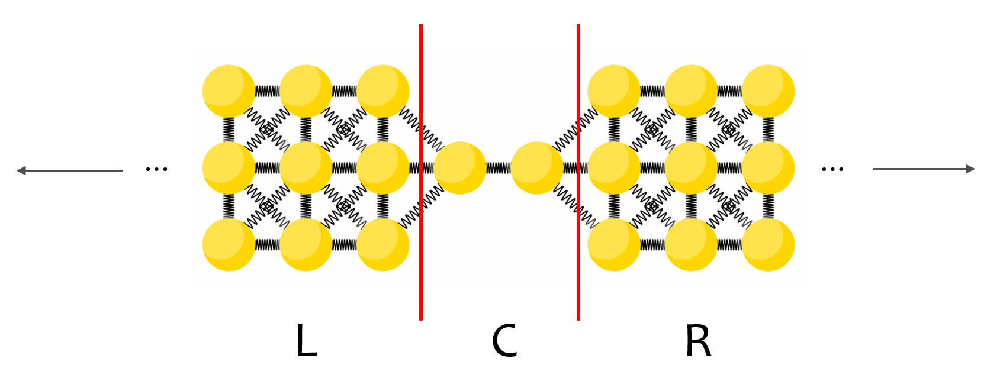

# PhonoKit



Phononic transmission calculation for different model configurations of electrodes and the scattering region.

## Configuration

Input is YAML. The main config is [plot/config_dat.yaml](plot/config_dat.yaml).

The `CALCULATION` block:

```yaml
CALCULATION:
  
  sys_descr: &descr "SystemDescription"
  data_path: "PathToSave"

  full_output_path: !join ["C:/Users/sevke/Desktop/Dev/MA/phonokit/plot/new_paper_results/periodic", *descr]

  M_E: "Au"
  M_C: "Au"
  E: [0.001, 25]
  N: 7000
  T_min: 0.001
  T_max: 300
  kappa_grid_points: 1000
  T_kappa_c: 77
```

Behavior in code:

1. `full_output_path` is used as output directory if present.
2. Otherwise `data_path` is used.
3. `!join` is supported by a custom YAML loader in [src/main.py](src/main.py).

Set up the system (example): Left electrode | Scattering region | Right electrode:

```yaml
ELECTRODE_L:
  DebyeModel:
    enabled: false
    E_D: 80
    k_coupl_x: 900
    k_coupl_xy: 0
  Chain1D:
    enabled: false
    k_el_x: 14400
    k_coupl_x: 14400
    interaction_range: 1
    interact_potential: reciproke_squared
    atom_type: Au
    lattice_constant: 3.0
  Ribbon2D:
    enabled: false
    N_y: 3
    k_el_x: 900
    k_el_y: 900
    k_el_xy: 90
    k_coupl_x: 900
    k_coupl_xy: 90
    interaction_range: 1
    interact_potential: reciproke_squared
    atom_type: Au
    lattice_constant: 3.0
  AnalyticalFourier:
    enabled: false
    N_q: 50
    k_el_x: 900
    k_el_y: 18
    k_el_xy: 0
    k_coupl_x: 180
    k_coupl_xy: 0
    interaction_range: 1
    interact_potential: reciproke_squared
    atom_type: Au
    lattice_constant: 3.0
  DecimationFourier:
    enabled: true
    N_y: 101
    N_q: 50
    k_el_x: 900
    k_el_y: 900
    k_el_xy: 90
    k_coupl_x: 900
    k_coupl_xy: 90
    interaction_range: 1
    interact_potential: reciproke_squared
    atom_type: Au
    lattice_constant: 3.0

ELECTRODE_R:
  DebyeModel:
    enabled: false
    E_D: 80
    k_coupl_x: 900
    k_coupl_xy: 0
  Chain1D:
    enabled: false
    k_el_x: 14400
    k_coupl_x: 14400
    interaction_range: 1
    interact_potential: reciproke_squared
    atom_type: Au
    lattice_constant: 3.0
  Ribbon2D:
    enabled: false
    N_y: 3
    k_el_x: 900
    k_el_y: 900
    k_el_xy: 90
    k_coupl_x: 900
    k_coupl_xy: 90
    interaction_range: 1
    interact_potential: reciproke_squared
    atom_type: Au
    lattice_constant: 3.0
  AnalyticalFourier:
    enabled: false
    N_q: 50
    k_el_x: 900
    k_el_y: 18
    k_el_xy: 0
    k_coupl_x: 180
    k_coupl_xy: 0
    interaction_range: 1
    interact_potential: reciproke_squared
    atom_type: Au
    lattice_constant: 3.0
  DecimationFourier:
    enabled: true
    N_y: 101
    N_q: 50
    k_el_x: 900
    k_el_y: 900
    k_el_xy: 90
    k_coupl_x: 900
    k_coupl_xy: 90
    interaction_range: 1
    interact_potential: reciproke_squared
    atom_type: Au
    lattice_constant: 3.0

SCATTER:
  Chain1D:
    enabled: false
    N: 2
    k_c_x: 180
    lattice_constant: 3.0
    interaction_range: 1
    interact_potential: reciproke_squared
    atom_type: Au
  FiniteLattice2D:
    enabled: true
    N_y: 1
    N_x: 2
    k_c_x: 900
    k_c_y: 900
    k_c_xy: 90
    lattice_constant: 3.0
    interaction_range: 1
    interact_potential: reciproke_squared
    atom_type: Au
```


## Run

```bash
python src/main.py plot/config_dat.yaml
```

## Output Defaults

By default, only these outputs are written:

1. `trans`
2. `trans_prob_matrices`

All other outputs are default `false` and can be enabled via `data_output`.

Supported `data_output` keys:

1. `write_trans` (default `true`)
2. `write_trans_prob_matrices` (default `true`)
3. `write_dos` (default `false`)
4. `write_trans_dos` (default `false`)
5. `write_kappa` (default `false`)
6. `write_greensf` (default `false`)
7. `write_bandstructure` (default `false`)
8. `plot_transmission` (default `false`)
9. `plot_dos` (default `false`)

Compatibility:

1. `calculate_bandstructure` is still accepted and mapped to `write_bandstructure`.

## Dependency installation

```bash
pip install -r requirements.txt
```

### References 
* "Highly efficient schemes for the calculation of bulk and surface Green functions", M P Lopez Sancho etal 1985 J.Phys.F:Met.Phys. 15 851\
  DOI: 10.1088/0305-4608/15/4/009
* M. Bürkle, Thomas J. Hellmuth, F. Pauly, Y. Asai, First-principles calculation of the thermoelectric figure of merit for [2,2]paracyclophane-based single-molecule junctions, PHYSICAL REVIEW B 91, 165419 (2015)\
  DOI: 10.1103/PhysRevB.91.165419
* Troels Markussen, Phonon interference effects in molecular junctions, J. Chem. Phys. 139, 244101 (2013)\
  DOI: 10.1063/1.4849178
